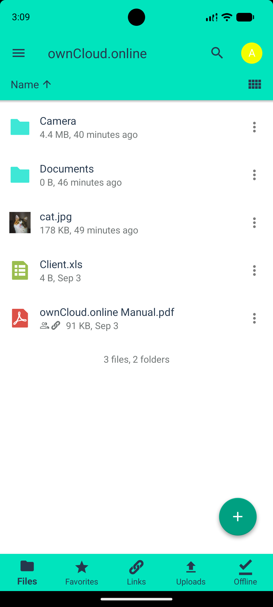
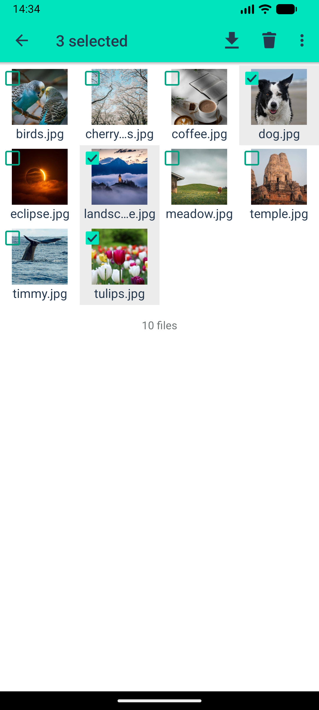
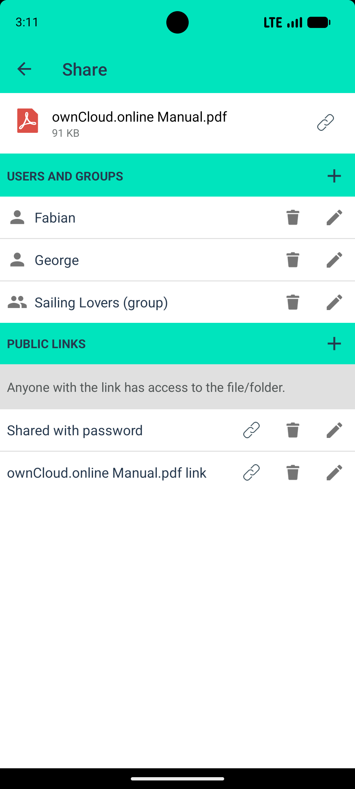
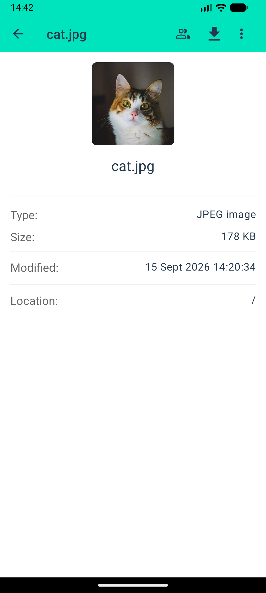

# owncloud.online für Android

Die Android-App zu owncloud.online: Dateien ansehen, hoch- und herunterladen,
teilen und Aufnahmen automatisch hochladen lassen.

|  |  |  |  |
| ---------------------------------------------- | -------------------------------------------- | ------------------------------------------- | ------------------------------------------- |

## Was sie kann

* **Dateien** durchsehen, öffnen, hoch- und herunterladen
* **Offline halten** — ausgewählte Ordner bleiben auf dem Gerät verfügbar und
  werden im Hintergrund abgeglichen
* **Automatischer Upload** von Fotos und Videos, auf Wunsch nur im WLAN
* **Teilen** über interne Freigaben und öffentliche Links mit Passwort und
  Ablaufdatum
* **Mehrere Konten** gleichzeitig
* **Anmeldung** per Benutzername und Passwort, OAuth2 oder OpenID Connect
* **Zugriffsschutz** über PIN, Muster oder die Biometrie des Geräts

## Bauen

Die Schritte stehen in [SETUP.md](SETUP.md). Kurz: Repository klonen, in Android
Studio öffnen, Gradle die Abhängigkeiten holen lassen.

Beiträge als Pull Request gegen `main`.

## Fehler melden

Als [Issue](https://github.com/BWTECH-github/Android/issues), bitte mit:

* Version der App und des Servers
* Android-Version und Gerät
* den Schritten, mit denen sich das Verhalten erzeugen lässt

**Sicherheitslücken nicht als Issue**, sondern vertraulich an
**security@bw.tech**.

## Herkunft und Lizenz

Fork der ownCloud-Android-App, gepflegt von der BW-Tech GmbH für
owncloud.online. Der Dank für die ursprüngliche Arbeit gehört der
ownCloud-Gemeinschaft. Lizenz: [GPLv2](LICENSE.txt).
